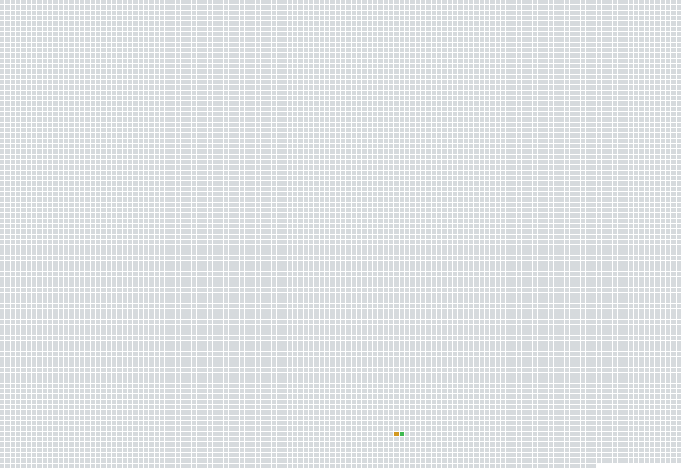

# fe3h-decomp

A work-in-progress decompilation of **Fire Emblem: Three Houses v1.2.0** (Switch), function by function.

This repository contains **only code we wrote**. It contains no game files. You need your own legally dumped copy of the game.

## Layout

```
data/          your dumped ExeFS main goes here (gitignored, never committed)
build/         generated files (gitignored)
functions.csv  every function we've looked at: address, size, name, status
include/       headers: structs and class definitions
src/           game code, organized by system (Camera/, Battle/, Unit/ ...)
lib/nn/        clean-room declarations for Nintendo SDK functions the game imports
lib/ktgl/      Koei Tecmo engine code, kept separate from game code
tools/         setup, diff, and progress scripts
docs/          notes and reference code
```

## Setup (Windows)

1. Install **Python 3**, then:
   ```
   pip install capstone lz4 pyelftools
   ```
2. Install **LLVM 6.0.1** for Windows (`LLVM-6.0.1-win64.exe`, from releases.llvm.org). The game's code byte-matches with public clang 5.0.1 and 6.0.x, built with `-O2 -g -mcpu=cortex-a57`. Newer versions schedule instructions differently and won't match. Install it to its own folder so it doesn't replace any newer LLVM you use.
3. Copy `config.example.json` to `config.json` and set `cxx` to your clang path, for example:
   ```json
   { "cxx": "C:/LLVM-6.0.1/bin/clang++.exe" }
   ```
4. Copy your dumped ExeFS **main** (v1.2.0) to `data/main`, then run:
   ```
   python tools/setup.py
   ```
   This decompresses it to `build/main.bin` and checks the build ID.

## Workflow

1. Find and understand a function in Ghidra.
2. Add it to `functions.csv` with `status` = `wip`.
3. Write it in C++ in the file listed in the csv.
4. Compare against the game:
   ```
   python tools/diff.py Camera::Set
   python tools/diff.py Camera::Set --diff
   ```
5. Update its status, then check overall progress:
   ```
   python tools/progress.py
   ```

### Status values

| Status | Meaning |
|---|---|
| `todo` | Found it, haven't started |
| `wip` | In progress |
| `decompiled` | Behavior understood and written in C++, not compared yet |
| `nonmatching` | Compared; same behavior, but not byte-identical |
| `matching` | Compiles to exactly the game's bytes |

### Scores from diff.py

- **exact**: same instructions, registers and order. 100% means a byte match.
- **shape**: same instructions and order, ignoring which register was used.
- **same**: how many of the game's instructions appear anywhere in yours.

## Progress Map



Each square is 1 KiB of code. 🟩 matching · 🟧 nonmatching · 🟨 in progress · ⬜ not started

## Addresses

Addresses are written the way Ghidra shows them, starting at `0x7100000000`. The 4:3 patch files use offsets without the `0x71` prefix.

## Rules

- **Never commit anything from `data/` or `build/`**, or any game asset.
- No leaked SDK material, ever. Everything in `lib/nn/` comes from the game's own import names and public documentation.

## How this started
Mostly just putting this here for the curious. This project began because I wanted to make a proper 4:3 mod for Three Houses for my 
Retroid Pocket Nova. I downloaded Ghidra and decided to hunt down the camera functions because attempting to modify existing ultrawide mods was leading
to issues. One byte matched function later I realized I had the foundations of a decomp project on my hands and decided to go ahead and make the repo for
keeping track of things and seeing if anyone else was interested. 

## License

- Code written is licensed under CC0 1.0 (see LICENSE)
- Fire Emblem: Three Houses is © Nintendo / Intelligent Systems / Koei Tecmo.
- This project contains no game code or assets; you'll need your own legally dumped copy.
